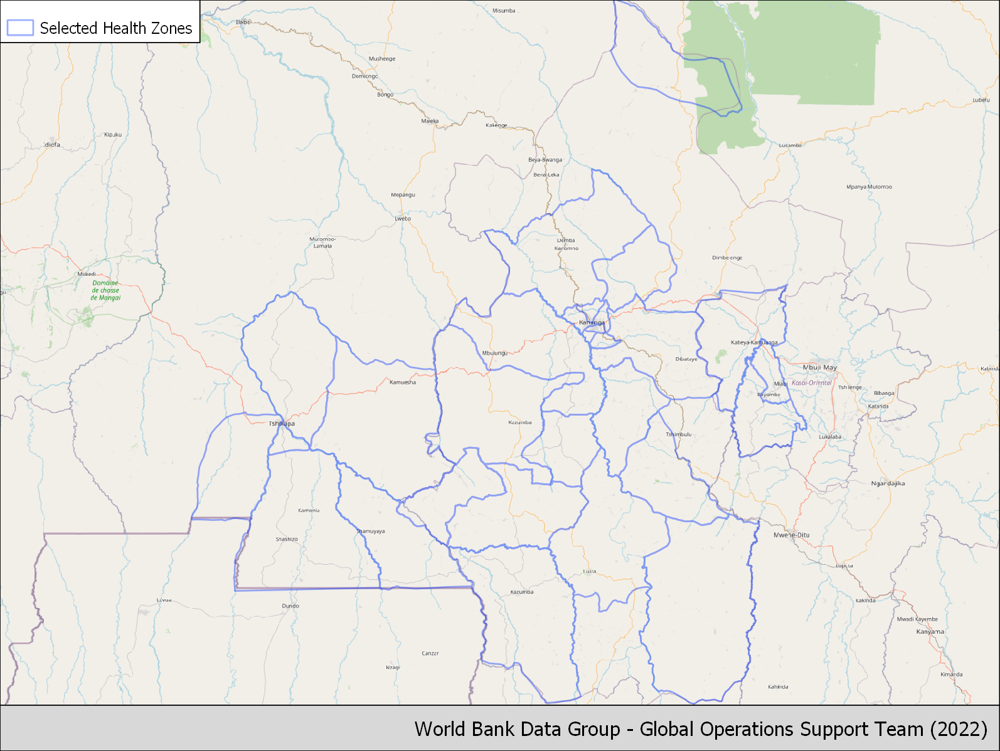
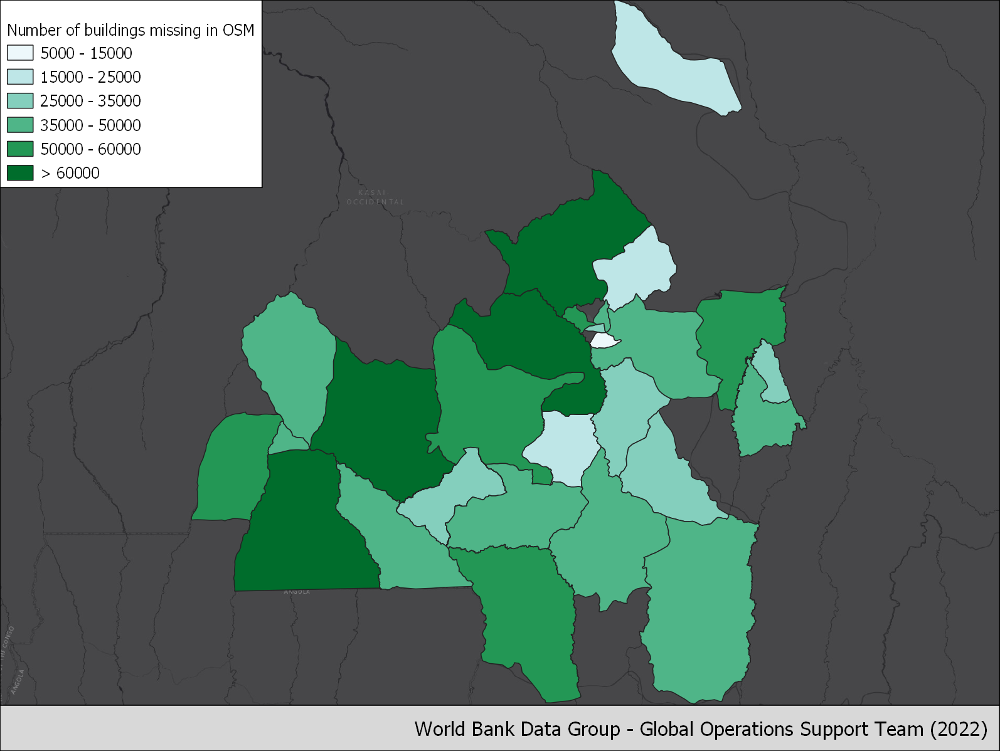

# Kasai Health Zones

## Introduction
Over the past five years, the DRC has consistently been in the top two countries with the highest number of new displacements associated with conflict (IDMC, 2021). In 2020 alone, the number of internally displaced people (IDPs) increased with an estimated 2.5 million individuals. Conflict accounted for nearly 90% of these displacements. The country is currently home to the second largest population of IDPs associated with conflict worldwide: an estimated 5.27 million Congolese are internally displaced, about 6% of the country's population (IDMC 2021). The vast majority of these IDPs do not reside in camps, but instead take refuge with local families (IDMC 2021, UNHCR 2021). In addition, thousands of Congolese refugees displaced in neighboring countries return home every year.
The proposed activities will take place in the three provinces in the Kasai region: Kasai, Kasai Central and Kasai Oriental. In 2016, the assassination of a traditional leader (Kamuina Nsapu) sparked a large violent conflict that spread across the three provinces. The conflict lasted until 2019 and caused the displacement of an estimated 1.4 million people (Mercy Corps, 2019). In recent years, the security situation has improved, but pockets of insecurity remain. While many people have been able to return home, hundreds of thousand individuals remain displaced. In addition, the Kasai provinces are home to nearly 20,000 repatriated Congolese refugees, who recently returned from Angola (UNHCR, 2020). More refugees are expected to return from Angola in the near future, and UNHCR Angola is actively supporting voluntary repatriation.
The interest of the geographical focus for the survey is threefold:
1. The triple nexus "Humanitarian-Development-Peace" is actively applied in the Kasai provinces to ensure a coordinated approach between humanitarian and development actors;
2. The recent withdrawal of the UN peacekeeping forces (MONUSCO) from the Kasai provinces generates a need for actors to ensure peace remains stable and therefore further engage resources towards the development of the provinces, while continuing to address the underlying economic causes of the conflict. A large number of development actors are planning to intensify their activities in the Kasai provinces. However, they lack accurate baseline data to make informed planning decisions;
3. Of the Kasai provinces host three groups of persons of concern for the UNHCR (returnees, IDPs and returned IDPs). This activity will enable to answer fundamental questions related to forced displacement on groups where the literature remains limited. In addition, the information on reintegration of returned refugees is of great importance to the UNHCR Angola operation to enable generating evidence of living conditions for those considering voluntary repatriation.

Given the huge data gap and indeed the challenge to collect data in this context, we explore the use of geospatial data to complement other more traditional data sources such as the Socio-economic survey in the Grand Kasai, DRC planned to take place in the coming months. It will focus on IDPs, returnees and host communities.


## Sample Maps
``` {tabbed} Selected health zones

```

``` {tabbed} Urbanization

```

``` {tabbed} Building density

```

``` {tabbed} Building density

```