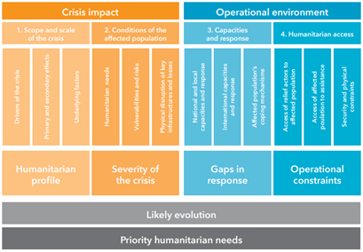

# Information and data needs of humanitarian and development actors 

## Forced Displacement as a challenge for humanitarian and development actors
In the paper [Forcibly Displaced - Toward a Development Approach Supporting Refugees, the Internally Displaced, and Their Hosts](https://openknowledge.worldbank.org/handle/10986/25016) the World Bank Group in partnership with UNHCR (2017) advocates for a closer cooperation between humanitarian and development actors. Forced displacement occurs predominantly in the developing world, with 99% of all Internally Displaced People (IDP) and 89% of refugees residing in developing countries in 2015. A large part of the Forcibly Displaced People (FDP) originate from small number of countries, including Syria, Afghanistan, Somalia, South Sudan, Sudan, Democratic Republic of the Congo, Central African Republic, Myanmar, Eritrea and Colombia, with a share of over 60% of the total; this list has stayed the same since 2006. As of 2015, only 24% of refugees lived in managed camps, mostly in Sub-Saharan Africa. For IDPs, this share is even smaller: only 1% live in managed camps, another 11% in self-settled camps, and the remainder stay in individual accommodations. 

That 2017 report continues to suggest that humanitarian actors, which aim at meeting short-term needs of affected populations, and development actors, which have the overall objective to reduce poverty, achieve best results when working together. Instead of an initial humanitarian response followed by a development effort once a crisis becomes protracted, both sets of actors can work complementarily throughout the period of forced displacement. Humanitarian and development agencies have different objectives, counterparts, and instruments, which can be beneficial. Development actors can play a beneficial role before, during, and after a crisis:
-	__Before a crisis__, they can discourage government policies that induce forced displacement and help host countries and host communities that expect an influx of people and strive to strengthen the resilience of those who stay behind. 
-	__During the crisis__, development actors can address challenges which could be exacerbated by the presence of FDPs; support those within the host communities which are disproportionally affected; strengthen and expand service delivery to accommodate the FDPs; and encourage granting the forcibly displaced the freedom of movement and the right to work. They can create economic opportunities by engaging with the private sector; invest in skills and education for the FDPs that are in demand at the labor market. 
-	__In the long term__, they can help returnees and communities that receive these returnees, which experience similar effects as the host communities; help "de facto" integrated people to obtain a satisfactory legal status; and continue helping in overcoming lasting vulnerabilities.  

So, if these humanitarian and development actors are to work in lockstep, what information are needed to best serve the FDPs and the host countries and communities? This question is difficult because of the varied agendas of each agency, and the variety of interventions that a humanitarian or development actor might choose. 
One basic requirement is accurate numbers and statistics about refugees, IDPs, and the affected population in the host countries. For refugees, this effort is led by UNHCR, but there are numerous issues that affect accurate data collection:
-	Methodologies vary from country to country depending on who is collecting information and their capacity
-	Refugees might be reluctant to register over concerns about security, and there might be few incentives to de-register. 
-	Numbers of refugees are politically sensitive, and both over- and underreporting of refugee numbers might be beneficial for political actors in the host country
For IDPs, the situation is even more complicated:
-	The definition of IDPs can be unclear
o	are nomadic populations considered?
o	are children of displaced people counted as IDPs?
-	Large numbers of IDPs have moved to urban settings, and there is no clear and operational definition of the end of internal displacement 
-	Countries might find it politically beneficial to report lower IDP numbers, for example to demonstrate progress in military operations, 
-	Countries or local actors might want to report high IDP numbers to receive international support. 
-	Security issues combined with the fluidity of population movement can make data collection very difficult. 

These challenges were confirmed during the interviews conducted for this study: one interviewee from IOM reported about his efforts in Mogadishu to map the IDP population. The IDP population is distributed over a large part of the city and interspersed with existing residents. The exact location of a group of IDPs is tied to the contact person, often the head of an extended family, but the actual place of residence of the individuals might then be in other parts of the city. Because of such challenges, data collected by humanitarian actors (WFP, UNHCR, IOM, ICRC) are rarely consistent across sources. 
Identifying data needs

An organization engaged in logistics will have  different information needs than an organization with a health-related agenda; long-term planners in sanitation at headquarters require different information than an organization working locally on maintenance of sanitation installations. Understanding data needs is an important first step in the data collection and analysis process, as it is impossible to maintain a repository of information to satisfy all demands.

The Multi-Sector Initial Rapid Assessment [MIRA](https://interagencystandingcommittee.org/system/files/mira_manual_2015.pdf) groups information needs into four components, see figure 2. These groupings encompass information about the scope of the crisis, conditions of the affected population, capacities and response, and humanitarian access. 

Figure 2: Coordinated assessment approach. From MIRA Coordinated Assessment approach 2015. 

Ideally, the operational requirements would define a comprehensive and finite list of geospatial data items which need to be collected and curated; we looked at previous attempts to come up with such a list; often by starting with an assessment of required information products:
-	[Mapaction](https://mapaction.org/) have developed a [catalog of map products](https://guides.mapaction.org/) for specific sectors or applications. We compiled their catalog of example products into a table relating the topic or sector to maps and information layers in these maps. This compilation is found in Annex 1 – Information and data needs by Cluster to this report. 
-	Cowan (2013) developed [A Geospatial Data Management Framework for Humanitarian Response](https://scholarspace.library.gwu.edu/concern/gw_etds/k3569440g). This PhD work included the compilation of a list of geospatial data items needed by humanitarian actors by stakeholder interviews. 
-	The Coordinated Data Scramble is a process to collect and combine essential datasets, which takes place at the onset of a crisis. The assessed information needs cover a wide range of topics, but a limited set of data items is seen as the most important: it comprises 25 priority datasets, as compiled by [ACAPS](https://www.acaps.org/) (Table 1)
-	[Van den Homberg et al. (2018)](https://www.sciencedirect.com/science/article/pii/S009830041730571X) identified 71 information needs for disaster response and suggested a methodology to assess their fulfillment as part of data preparedness efforts. 
-	The Humanitarian Data Exchange platform HDX identifies a set of essential data which they actively monitor called the Data Grids. 

 Theme | Data item 
 ----  | --------- 
 Geography and climate | Adminstrative Boundaries
 Geography and climate | Climate or precipitation
 Geography and climate | Terrain/elevation
 Geography and climate | Settlement data
 Geography and climate | Geographic Areas Affected
 Infrastructure | Transport Network
 Infrastructure | Functionality and location of main markets
 Infrastructure | Electricity supply
 Infrastructure | Communication Channels
 Population Profile | Demography
 Population Profile | Socio-economic profile population
 Population Profile | number and location of those displaced
 Population Profile | People in moderate or severe need per sector
 Coping Mechanisms | Traditional coping mechanisms
 Health | Morbidity and mortality rates/main causes
 Health | number and % of health care facilities and their status (functional/non-functional)
 Nutrition | Malnutrition Rates
 Education | Number and % of education facilities and their status (functional/non-functional)
 Access | Estimated # and location of people in need who cannot be reached by humanitarian actors
 Response Capacity | Sector Specific 4/W
 Coordination Structure | Humanitarian Coordination Structure
 Coordination Structure | Contact list
 Lessons Learned | Operational lessons learned from previous disasters

 **Table 1: CDS priority datasets (from ACAPS)** 

We combined, collated, and reduced the four assessments referenced above and came up with 233 potential geospatial data items. This does not mean that all possible uses are covered as the sources of for this list mostly have a humanitarian perspective. The combined list is found in **Annex 2 - List of geospatial Data Items.**
